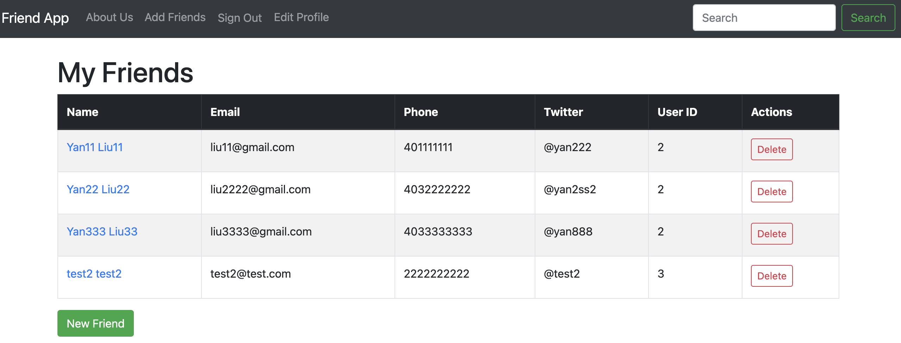

# Learn Ruby on Rails - Full Course 2025

Learn from Youtube [FreeCodeCamp](https://www.youtube.com/watch?v=fmyvWz5TUWg&t=12635s&ab_channel=freeCodeCamp.org), add some update code for new version of Ruby on Rails.

## Install Ruby on Rails on Mac
I normally use Windows, but I heard installation can be more difficult there, so I decided to follow this tutorial on my Mac instead. I installed Ruby and Rails using the official guide: 
https://guides.rubyonrails.org/install_ruby_on_rails.html#install-ruby-on-macos

Since I already had Xcode, Homebrew, and Node.js set up on my Mac, I was able to skip some of the installation steps in the guide.

After completing the steps, I found that I didn't need to install SQLite or Yarn separately — they were already taken care of. That was great!

## CRUD Project
Developed a Friends List application with full CRUD functionality, allowing users to create, read, update, and delete friends. Implemented user authentication using Devise, with separate User and Friend tables and proper associations. Each authenticated user can manage their own list of friends, with individual friend records displayed in a table, including links to view and edit details.
 
 

</img>  
1. There is different Renders each friend via a partial in `_friend.html.erb` file

 

| Feature                   | New Version                 | Old Version                     |
|---------------------------|-----------------------------|---------------------------------|
| Render partials           | ✅ `<%= render friend %>`   | ❌ Manual table row output      |
| Link to show/edit         | ✅ Included via partial     | ✅ Manual links in table        |

2. Set login and signup pages
Reference devise in `rubygems.org`

3. Tables association
Build user table and friends table one to many relation
In terminal, `rails g migration add_user_id_to_friends user_id:integer:index`
